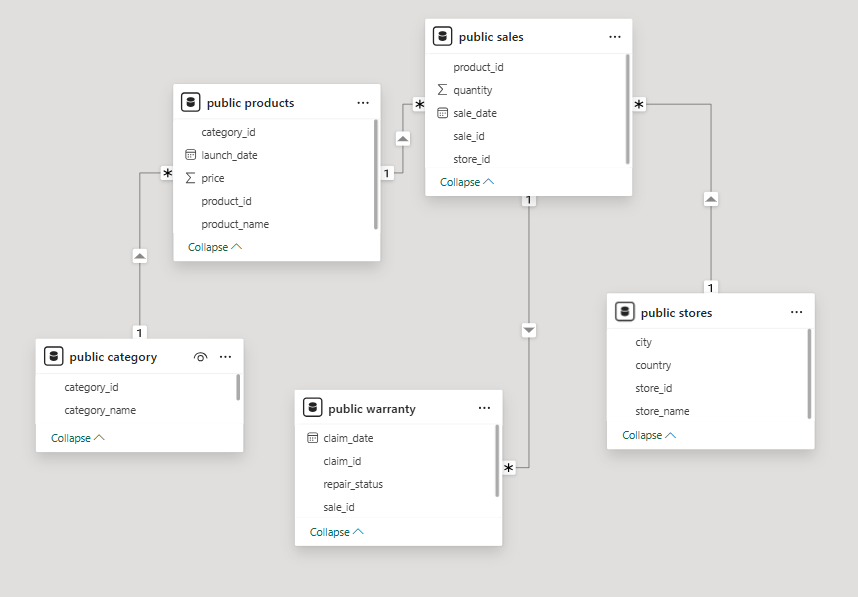
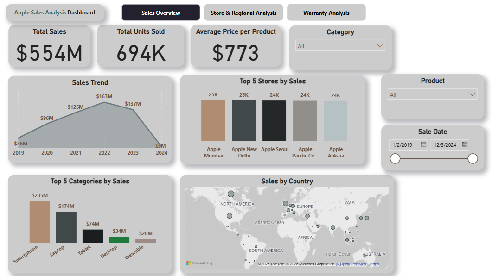
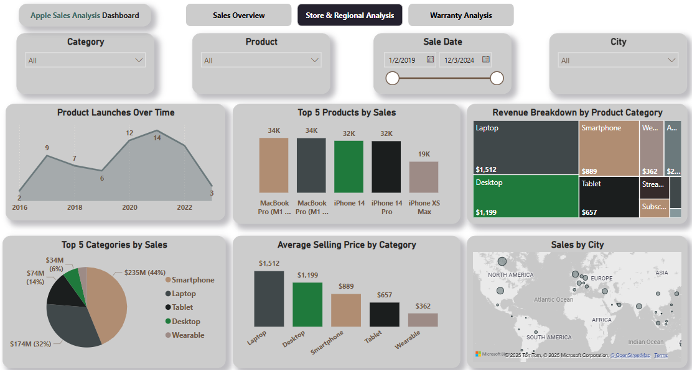
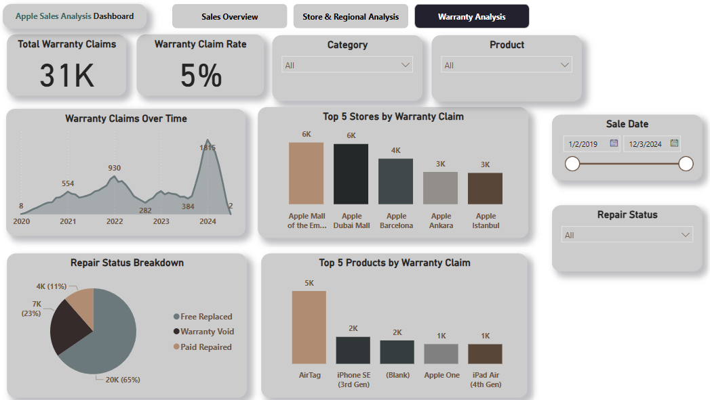

# 🍏 Apple Sales Analysis – SQL + Power BI Project

## 📌 Project Overview
This project analyzes Apple sales data using SQL and Power BI. It focuses on sales trends, product performance, warranty claims, and store performance, offering insights into business operations and product quality.

- **Tools**: PostgreSQL (SQL), Power BI  
- **Dataset**: Apple Sales Data (Sales, Products, Warranty, Stores, etc.)  

---

## 🎯 Objectives

- Set up and query a structured Apple sales database  
- Clean and prepare the data using SQL  
- Explore sales, warranty claims, and product trends  
- Build an interactive dashboard in Power BI for business stakeholders  

---

## 🗂️ Dataset Description

| Table Name     | Column Name            | Description                                      |
|----------------|------------------------|--------------------------------------------------|
| **stores**     | store_id               | Unique identifier for each store                 |
|                | store_name             | Name of the store                                |
|                | city                   | City where the store is located                  |
|                | country                | Country of the store                             |
| **category**   | category_id            | Unique identifier for each product category      |
|                | category_name          | Name of the category                             |
| **products**   | product_id             | Unique identifier for each product               |
|                | product_name           | Name of the product                              |
|                | category_id            | References the category table                    |
|                | launch_date            | Date when the product was launched               |
|                | price                  | Price of the product                             |
| **sales**      | sale_id                | Unique identifier for each sale                  |
|                | sale_date              | Date of the sale                                 |
|                | store_id               | References the stores table                      |
|                | product_id             | References the products table                    |
|                | quantity               | Number of units sold                             |
| **warranty**   | claim_id               | Unique identifier for each warranty claim        |
|                | claim_date             | Date the claim was made                          |
|                | sale_id                | References the sales table                       |
|                | repair_status          | Status of the warranty claim (e.g., Paid Repaired, Warranty Void) |

---

## 🖼️ ER Diagram



---

## 📈 Power BI Dashboard

### 🔹 Page 1: Sales Overview  
**Goal:** Show KPIs and category-level performance.  

**Visuals:**  
- **KPI Cards**: Total Sales, Total Units Sold, Average Price per Product  
- **Line Chart**: Sales Trend by Month/Year  
- **Bar Chart**: Top 5 Stores by Total Sales  
- **Bar Chart**: Top 5 Categories by Sales  
- **Map Chart**: Sales by Country  


---

### 🔹 Page 2: Store & Regional Analysis  
**Goal:** Provide insights into product launches and store performance.  

**Visuals:**  
- **Line Chart**: Product Launches Over Time  
- **Bar Chart**: Top 5 Products by Sales  
- **Treemap**: Revenue Breakdown by Product  
- **Pie Chart**: Top 5 Categories by Sales  
- **Bar Chart**: Average Selling Price by Category  
- **Map Chart**: Sales by City  


---

### 🔹 Page 3: Warranty Analysis  
**Goal:** Analyze warranty claims and repair status.  

**Visuals:**  
- **KPI Cards**: Total Warranty Claims, Warranty Claim Rate  
- **Line Chart**: Warranty Claims Over Time  
- **Pie Chart**: Repair Status Breakdown  
- **Bar Chart**: Top 5 Stores by Warranty Claims  
- **Bar Chart**: Top 5 Products by Warranty Claims  

---

## SQL Queries for Apple Sales Analysis

### 1. Number of Stores by Country
```sql
SELECT country, COUNT(store_id) AS Total_Stores
FROM stores
GROUP BY country
ORDER BY Total_Stores DESC;
```
### 2. Total Units Sold by Each Store
```sql
SELECT 
    st.store_id,
    st.store_name,
    SUM(quantity) AS total_units
FROM sales sl 
INNER JOIN stores st ON st.store_id = sl.store_id
GROUP BY st.store_id, st.store_name
ORDER BY total_units DESC;

```

### 3. Total Sales in December 2023
```sql
SELECT COUNT(sale_id) AS total_sales
FROM sales
WHERE TO_CHAR(sale_date, 'MM-YYYY') = '12-2023';


```

### 4. Number of Stores Without Warranty Claims
```sql
SELECT * 
FROM stores
WHERE store_id NOT IN (
    SELECT DISTINCT(store_id)
    FROM warranty w
    LEFT JOIN sales s ON w.sale_id = s.sale_id
);

```

### 5. Least Selling Product of Each Country (Annual)
```sql
WITH product_rank AS (
    SELECT
        st.country,
        p.product_name,
        EXTRACT(YEAR FROM sl.sale_date) AS year,
        SUM(sl.quantity) AS total_quantity_sold,
        RANK() OVER(PARTITION BY st.country, EXTRACT(YEAR FROM sl.sale_date) ORDER BY SUM(sl.quantity) DESC) AS rank
    FROM
        stores st
    JOIN sales sl ON st.store_id = sl.store_id
    JOIN products p ON p.product_id = sl.product_id
    GROUP BY st.country, p.product_name, EXTRACT(YEAR FROM sl.sale_date)
)
SELECT *
FROM product_rank
WHERE rank = 1;


```

### 6. Warranty Claims Within 180 Days of Sale
```sql
SELECT
    w.*,
    s.sale_date,
    w.claim_date - s.sale_date AS Claim_days
FROM warranty w 
LEFT JOIN sales s ON s.sale_id = w.sale_id
WHERE w.claim_date - s.sale_date <= 180;


```

### 7. Monthly Running Total of Sales for Each Store
```sql
WITH monthly_sales AS (
    SELECT
        s.store_id,
        EXTRACT(YEAR FROM s.sale_date) AS year,
        EXTRACT(MONTH FROM s.sale_date) AS month,
        SUM(p.price * s.quantity) AS total_revenue
    FROM sales s
    JOIN products p ON p.product_id = s.product_id
    GROUP BY s.store_id, year, month
    ORDER BY s.store_id, year, month
)
SELECT 
    store_id,
    month,
    year,
    total_revenue,
    SUM(total_revenue) OVER(PARTITION BY store_id ORDER BY year, month) AS running_total
FROM monthly_sales;


```

### 8. Store with Highest "Paid Repaired" Claims Percentage
```sql
WITH paid_repair AS (
    SELECT 
        s.store_id,
        COUNT(w.claim_id) AS paid_repaired
    FROM sales s
    RIGHT JOIN warranty w ON s.sale_id = w.sale_id
    WHERE w.repair_status = 'Paid Repaired'
    GROUP BY 1
),
total_repaired AS (
    SELECT 
        s.store_id,
        COUNT(w.claim_id) AS total_repaired
    FROM sales s
    RIGHT JOIN warranty w ON s.sale_id = w.sale_id
    GROUP BY 1
)
SELECT
    tr.store_id,
    st.store_name,
    pr.paid_repaired,
    tr.total_repaired,
    ROUND(pr.paid_repaired::NUMERIC / tr.total_repaired::NUMERIC * 100, 2) AS percentage_paid_repaired
FROM paid_repair pr
JOIN total_repaired tr ON pr.store_id = tr.store_id
JOIN stores st ON st.store_id = tr.store_id
ORDER BY percentage_paid_repaired DESC;


```

## Resources:
- The **Power_BI** section contains all the pages with screenshots and the Power BI file.
- The **SQL** section includes all the SQL queries with explanations in the same document.
- The **Data** section provides the dataset used for this project.

Now everything is in one file. Let me know if you need any further adjustments!

